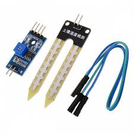
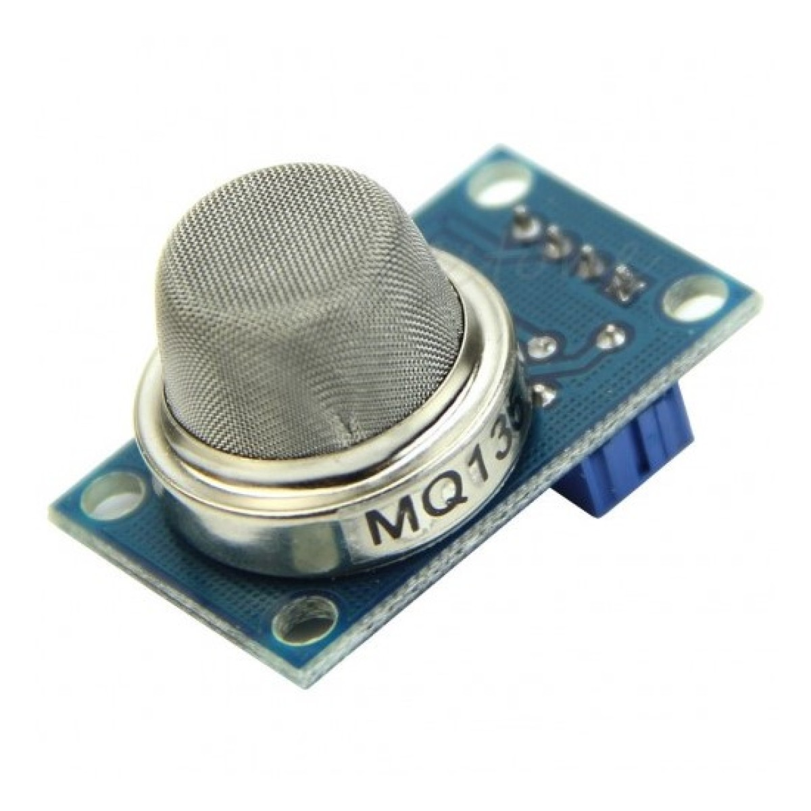
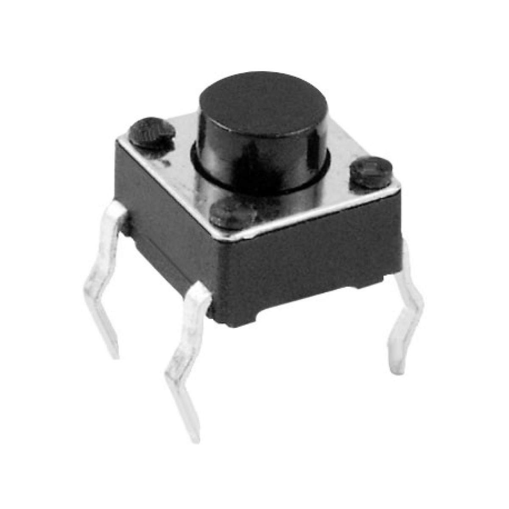
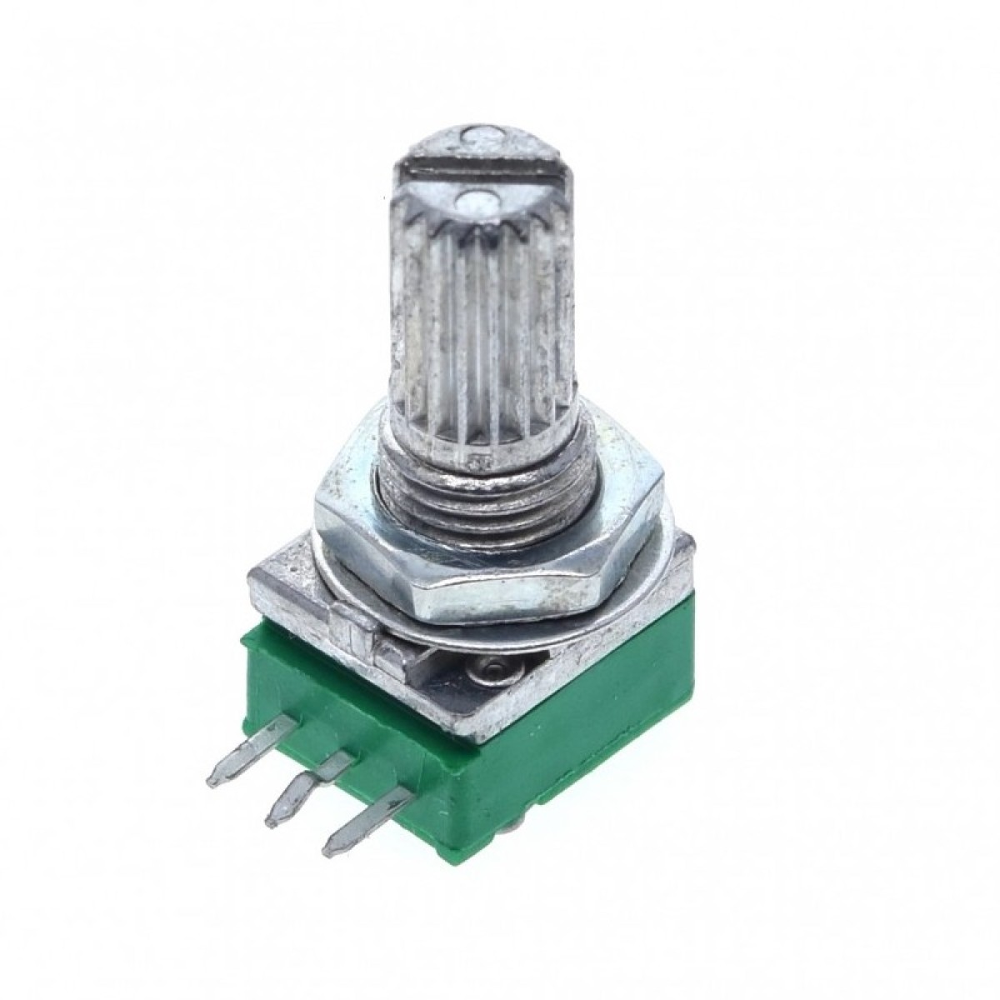
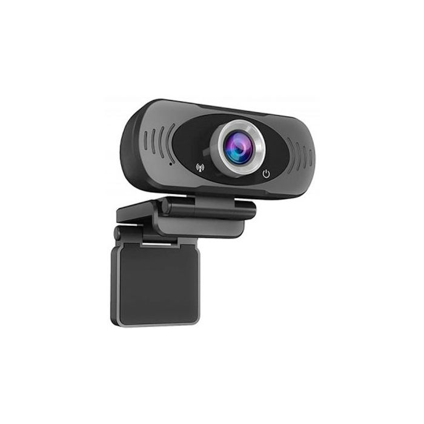
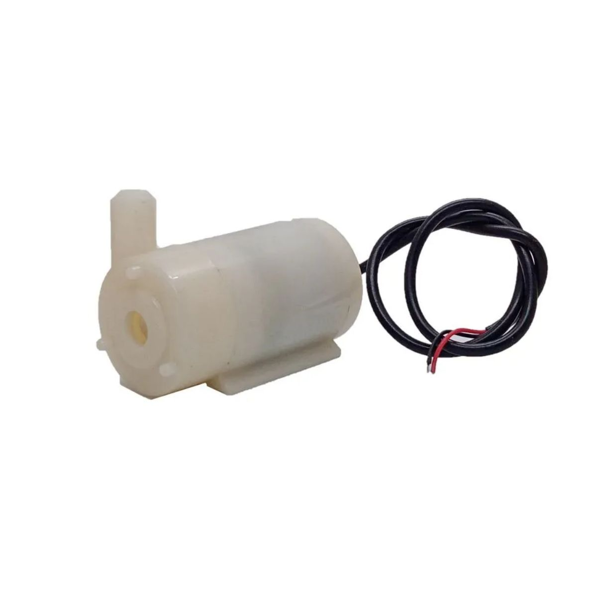
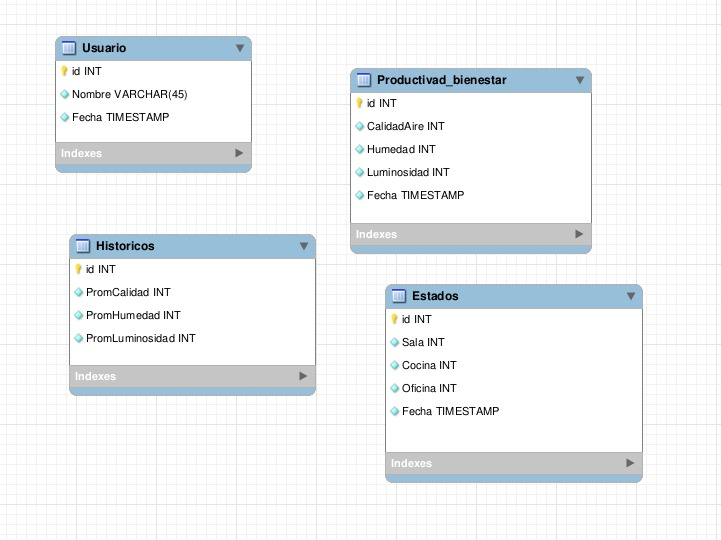
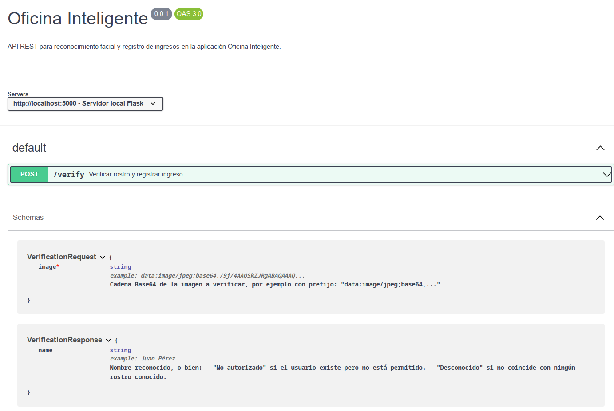

# Universidad de San Carlos de Guatemala

# Facultad de ingenieria

# Escuela de ciencias y sistemas

# Arquitectura de computadores y ensambladores 2

# Proyecto 2

---

## Descripcion de la solucion
### vision general del proyecto
El proyecto consiste en un sistema de automatización inteligente para espacios de oficina, diseñado para mejorar la productividad, eficiencia energética y bienestar laboral mediante tecnologías IoT, Machine Learning y Cloud Computing. El sistema integra sensores, actuadores y un broker MQTT para el control remoto de dispositivos, junto con dashboards interactivos para monitoreo en tiempo real.

### Arquitectura 


## Capas del Framework
# Capas del Framework IoT – Sistema de Automatización Inteligente

## 1. Capa de Hardware
- **Sensores y actuadores:**
  - `Sensor de humedad`: Control del riego en huerto con minibomba de agua.
  - `Sensor de gas (MQ)`: Detección de gases contaminantes en habitaciones.
  - `Botones de ocupación`: Indican presencia en cada cuarto de la maqueta.
  - `Sistema de iluminación`: Controlado por potenciómetro (simulación de dimmer).
  - `Cámara`: Reconocimiento facial para autenticación de usuarios.
- **Dispositivos de control:**
  - `Arduino Mega`: Lectura de sensores, control de actuadores y comunicación con el servidor mediante MQTT.
- **Infraestructura:**
  - Maqueta con **6 areas**, **un huerto** y **una talaquera para seguridad**.
  - Red local configurada para conexión del backend y sensores.

---

## 2. Capa de Software
- **Firmware en Arduino Mega:**
  - Lectura y control en tiempo real de sensores (humedad, gas, ocupación, iluminación).
  - Publicación de datos vía MQTT al backend.
- **Backend (Node.js):**
  - Recepción de datos de sensores a través de MQTT (`Mosquitto`).
  - Procesamiento y almacenamiento en **MySQL alojado en AWS**.
  - Módulo de reconocimiento facial para autenticación mediante cámara.
- **Frontend (Vite):**
  - Visualización de gráficos en tiempo real con **Grafana** incrustado.
  - Mapas interactivos de ocupación de habitaciones.
  - Interfaz de usuario para diagnóstico ambiental y control básico.

---

## 3. Capa de Comunicación
- **Protocolo MQTT:**
  - **Broker:** Mosquitto (en red local o en la nube).
  - **Topics usados:**
    - `sensor/humedad`: Lecturas de humedad del huerto.
    - `sensor/gas`: Detección de gases.
    - `cuartos/ocupacion`: Estado de ocupación por cuarto.
    - `iluminacion/nivel`: Datos del potenciómetro.
    - `reconocimiento/usuario`: Resultado del reconocimiento facial.
  - **QoS:** Nivel 1 para asegurar entrega de datos críticos.
- **Conexión serial/UART:**
  - Arduino se comunica con módulos que envían datos al backend.

---

## 4. Plataforma en la Nube
- **Almacenamiento en AWS:**
  - **Base de datos MySQL en RDS:** Guarda datos históricos por sensores, ocupación y autenticaciones.
- **Broker Mosquitto (opcional en la nube):**
  - Para extender el alcance del sistema y permitir administración remota.
- **Seguridad:**
  - Encriptación `TLS/SSL` para conexiones MQTT seguras.
  - Autenticación mediante reconocimiento facial (sin contraseñas).

---

## 5. Aplicaciones en la Nube
- **Grafana:**
  - Dashboards personalizados para:
    - Niveles de humedad y alertas de riego automático.
    - Presencia por habitación (ocupación en tiempo real).
    - Detección de gases y alertas ambientales.
    - Historial de acceso mediante reconocimiento facial.
  - Integración directa con MySQL y MQTT.
- **Backend enlazado a la DB en AWS:**
  - Recibe datos del frontend para interacción y visualización.
  - Sirve gráficos e información contextual de sensores.
    
# Descripción de los Sensores

### Sensor de Humedad de Suelo

| **Tamaño**     | **Tipo de Lectura** | **Instalación**         | **Rango de Medición** | **Unidad de Medida** | **Imágenes** | **Precio Estimado** | **Fechas de Importación** |
|----------------|---------------------|--------------------------|------------------------|----------------------|--------------|---------------------|---------------------------|
| 60mm x 20mm    | Analógica            | Enterrado en el huerto   | 0 – 1023 (ADC)         | % humedad relativa   |  | Q12.00              | PENDIENTE             |

**Enlace para comprar**: [Sensor de Humedad](https://oxdea.gt/product/sensor-de-humedad-del-suelo-yl38-y-yl69/)

---

### Sensor de Gas MQ-135

| **Tamaño**     | **Tipo de Lectura** | **Instalación**         | **Rango de Medición**         | **Unidad de Medida** | **Imágenes** | **Precio Estimado** | **Fechas de Importación** |
|----------------|---------------------|--------------------------|-------------------------------|----------------------|--------------|---------------------|---------------------------|
| 32mm x 20mm    | Analógica / Digital | Ambiente (habitaciones) | 10–1000 ppm (amoniaco, alcohol, benceno, etc.) | ppm                  |  | Q25.00              | PENDIENTE                |

**Enlace para comprar**: [Sensor MQ-135](https://laelectronica.com.gt/sensor-de-calidad-de-aire-mq-135)
---
### Botones de Ocupación (Push Button)

| **Tamaño**     | **Tipo de Lectura** | **Instalación**     | **Rango de Medición** | **Unidad de Medida** | **Imágenes** | **Precio Estimado** | **Fechas de Importación** |
|----------------|---------------------|----------------------|------------------------|----------------------|--------------|---------------------|---------------------------|
| 12mm diámetro  | Digital (ON/OFF)    | En cada cuarto       | Presionado / No presionado | Booleano (1 o 0)     |  | Q3.00               | PENDIENTE             |

**Enlace para comprar**: [Botón tipo Push](https://laelectronica.com.gt/pulsador-na)

---

### Potenciómetro (Control de Iluminación)

| **Tamaño**     | **Tipo de Lectura** | **Instalación**     | **Rango de Medición** | **Unidad de Medida** | **Imágenes** | **Precio Estimado** | **Fechas de Importación** |
|----------------|---------------------|----------------------|------------------------|----------------------|--------------|---------------------|---------------------------|
| 16mm diámetro  | Analógica           | Panel de control     | 0 – 1023 (ADC)         | Nivel (0–100%)       |  | Q5.00               | PENDIENTE              |

**Enlace para comprar**: [Potenciómetro 10kΩ](https://laelectronica.com.gt/potenciometro-rk097n-de-audio-con-switch-de-10k-ohms)

---

### Cámara USB para Reconocimiento Facial

| **Tamaño**     | **Tipo de Lectura** | **Instalación**     | **Rango de Medición** | **Unidad de Medida** | **Imágenes** | **Precio Estimado** | **Fechas de Importación** |
|----------------|---------------------|----------------------|------------------------|----------------------|--------------|---------------------|---------------------------|
| 60mm x 30mm    | Video digital        | Frente a entrada     | Resolución 640x480 o más | Imagen facial       |  | Q150.00              | PENDIENTE               |

**Enlace para comprar**: [Cámara USB genérica](https://intelite.gt/producto/camara-web-cm-cmsxj22a/)

---

### Minibomba de Agua

| **Tamaño**     | **Tipo de Lectura** | **Instalación**     | **Rango de Medición** | **Unidad de Medida** | **Imágenes** | **Precio Estimado** | **Fechas de Importación** |
|----------------|---------------------|----------------------|------------------------|----------------------|--------------|---------------------|---------------------------|
| 45mm x 24mm    | Activador digital   | Integrada al sistema de riego | Encendido / Apagado | Booleano (1 o 0)     |  | Q20.00              | PENDIENTE               |

**Enlace para comprar**: [Mini bomba de agua DC](https://www.kemik.gt/mini-bomba-de-agua-5v-cc-sumergible)

---


## Modelo de Entidad Relacion



## api contracts


```yaml
openapi: 3.0.3
info:
  title: Oficina Inteligente
  version: 0.0.1
  description: >
    API REST para reconocimiento facial y registro de ingresos en la aplicación Oficina Inteligente.

servers:
  - url: http://localhost:5000
    description: Servidor local Flask

paths:
  /verify:
    post:
      summary: Verificar rostro y registrar ingreso
      description: >
        Recibe una imagen en Base64, detecta rostros conocidos y:
        - Si coincide con un usuario autorizado, registra el ingreso y devuelve su nombre.
        - Si coincide pero el usuario no está en la base de datos, devuelve "No autorizado".
        - Si no se detecta un rostro conocido, devuelve "Desconocido".
      requestBody:
        required: true
        content:
          application/json:
            schema:
              $ref: '#/components/schemas/VerificationRequest'
      responses:
        '200':
          description: Resultado del reconocimiento facial
          content:
            application/json:
              schema:
                $ref: '#/components/schemas/VerificationResponse'
        '400':
          description: Solicitud inválida (imagen no proporcionada)
          content:
            application/json:
              schema:
                type: object
                properties:
                  error:
                    type: string
                    example: "No image provided"

components:
  schemas:
    VerificationRequest:
      type: object
      required:
        - image
      properties:
        image:
          type: string
          description: |
            Cadena Base64 de la imagen a verificar, por ejemplo con prefijo:
            "data:image/jpeg;base64,..." 
          example: "data:image/jpeg;base64,/9j/4AAQSkZJRgABAQAAAQ..."

    VerificationResponse:
      type: object
      properties:
        name:
          type: string
          description: >
            Nombre reconocido, o bien:
            - "No autorizado" si el usuario existe pero no está permitido.
            - "Desconocido" si no coincide con ningún rostro conocido.
          example: "Juan Pérez"
```


## Scripts

```yaml
SELECT Fecha AS time, Sala AS value, 'Sala' AS metric FROM Estados
UNION ALL
SELECT Fecha AS time, Cocina AS value, 'Cocina' AS metric FROM Estados
UNION ALL
SELECT Fecha AS time, Oficina AS value, 'Oficina' AS metric FROM Estados;
```

## Valor Disruptivo del Proyecto

El proyecto presenta un valor disruptivo significativo al integrar tecnologías emergentes como **IoT**, **Machine Learning** y **Cloud Computing** en una solución accesible, modular y enfocada en **mejorar el bienestar y la eficiencia energética de espacios de oficina o residenciales**.

### Principales elementos disruptivos:

- 🔐 **Autenticación sin contacto mediante reconocimiento facial:** Reemplaza métodos tradicionales de acceso (tarjetas, contraseñas) por un sistema biométrico no intrusivo, aumentando la seguridad y reduciendo riesgos de suplantación o contagios.

- 🌱 **Automatización del entorno físico basada en datos en tiempo real:** El sistema controla el riego, iluminación y ocupación de oficinas de forma autónoma, optimizando el uso de recursos como agua y energía.

- 📊 **Visualización dinámica con Grafana:** Los usuarios pueden monitorear condiciones ambientales y estados de ocupación en tiempo real desde un dashboard intuitivo, incluso desde entornos remotos.

- ☁️ **Arquitectura basada en la nube y MQTT:** Permite escalabilidad, integración con servicios de terceros y comunicación eficiente entre dispositivos, superando barreras de conectividad local.

- 🧠 **Base para sistemas inteligentes adaptativos:** El diseño modular abre la puerta a incorporar algoritmos de aprendizaje automático que permitan anticipar acciones, como ajustar la iluminación según patrones de uso o activar ventilación al detectar gases.

---

### Diferenciación frente a soluciones tradicionales:

| Característica                         | Sistemas tradicionales       | Nuestro sistema                       |
|---------------------------------------|------------------------------|---------------------------------------|
| Acceso                                | Manual (llaves/tarjetas)     | Reconocimiento facial automático      |
| Control ambiental                     | Manual o por horarios fijos  | Dinámico, según sensores              |
| Visualización                         | Limitada o inexistente       | Dashboards en tiempo real con Grafana |
| Expansibilidad                        | Baja o costosa               | Modular, adaptable y basado en estándares |
| Almacenamiento de datos históricos    | Inexistente o local          | Base de datos en la nube (MySQL AWS)  |

Este enfoque transforma la manera en que se gestionan los espacios, haciendo que hogares y oficinas no solo reaccionen, sino que **anticipen** y **aprendan** de su entorno y usuarios.

