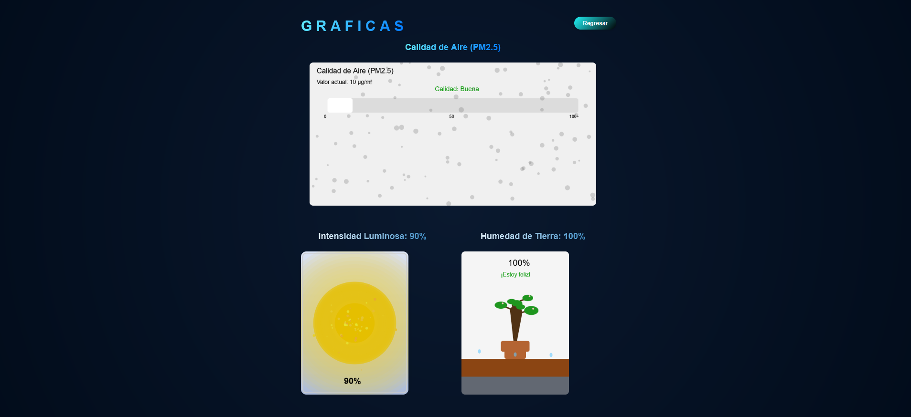
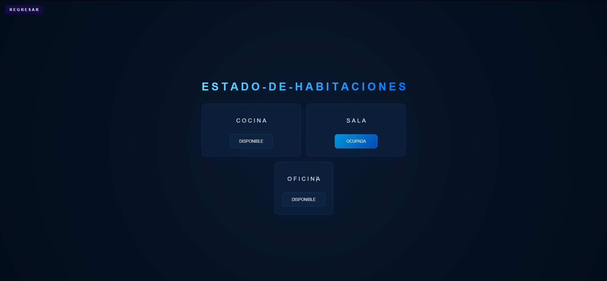

# Manual de Usuario

---
## 🛠 Tecnologías Utilizadas

| Tecnología     | Logo | Descripción |
|---------------|------|-------------|
| **Arduino**   |  | Plataforma de hardware programable para dispositivos IoT. |
| **React + Vite** |   | Framework frontend con herramienta de construcción ultrarrápida. |
| **AWS**       |  | Plataforma en la nube para despliegue y gestión de servicios. |
| **MQTT**      |  | Protocolo ligero de mensajería para machine-to-machine (M2M). |
| **Grafana**   |  | Plataforma de visualización y monitoreo de datos en tiempo real. |
| **p5.js**     |  | Librería JavaScript para creación de gráficos y arte interactivo. |

## Funcionamiento de la aplicacion

### 1. 🔒 Login

Al ejecutar la aplicación, se despliega una interfaz de inicio de sesión con reconocimiento facial. El usuario solo podrá acceder si su rostro coincide con las muestras registradas previamente en el sistema.

 📌 Nota: Asegúrate de tener buena iluminación y posicionar tu rostro correctamente para un escaneo óptimo.

### 2. 📊 Dashboard Principal

Interfaz Principal

Una vez autenticado, se muestra el panel de control principal, que incluye tres opciones interactivas:
  -   📈 Productividad y Bienestar
  -  ⏱️ Métricas en Tiempo Real
  -  🚪 Estado de Habitaciones

### 3. 🌱 Productividad y Bienestar

Si seleccionamos la opcion de productividad y bienestar nos despliegara la siguiente interfaz en la cual podemos observar el monitoreo de 3 graficas realizadas con p5.js, en la que podemos:
-  observar la calidad del aire, representada por particulas las cuales se vuelven mas oscuras dependiendo la contaminacion que haya en el aire
- una bombilla la cual se va reflejando la intensidad luminosa que ella emite en tiempo real, observando tanto el porcentaje como la intensidad de la misma
- una planta la cual representa su estado entre: seco, estable y humedo

### 4. Estado de Habitaciones

Al ingresar a la siguiente interfaz de Estado de habitaciones, podremos observar un monitoreo en el cual nos indica si la habitacion esta ocupada o dispnible, intercambiando de color cada boton, reflejado en celeste si esta ocupada y azul si esta disponible

